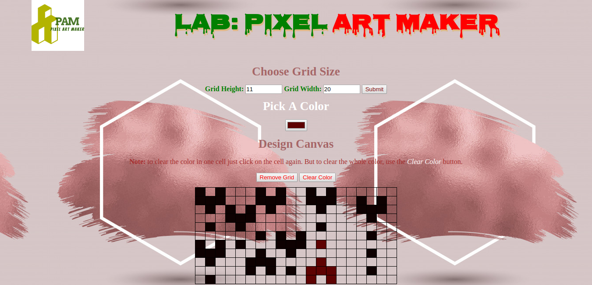

# Pixel Art Maker Project

## Table of Contents

* [Instructions](#instructions)
* [Contributing](#contributing)
* [Live Page](#live_page)
* [New Functionality](#new_functionality)
* [Slack Handle](#slack_handle)
* [Experience](#experience)
* [Appreciation](#appreciation)

## Instructions

To get started, open `designs.js` and start building out the app's functionality.

For specific, detailed instructions, look at the project instructions in the [Udacity Classroom](https://classroom.udacity.com/me).

## Contributing

This repository is the starter code for _all_ Udacity students-. Therefore, we most likely will not accept pull requests.

## Live_Page
To test and review the live page for the **Pixel Art Maker** please click [here](https://theshedman.github.io/).

## New_Functionality
I also added some few functionalities like _**Remove Grid**_ and _**Clear Color**_ Buttons. The former will remove the whole grid should the user wants to remove all the grid without making use of the _**submit**_ button which clears and draw new grid. While the _**Clear Color**_ button will clear the whole color in the grid. This is used when the user wants to clear the old color/art on the grid or to draw new pixel art. Forcing the user to achieve this by clicking on the cells one after the other is boringsome and as well not a great user experience (UX) and so I added the functionality for the task.
**Note:** the user can still click on a cell to clear the color on that very cell should s/he makes a _**minor**_ mistake while painting on the grid.

## Slack_Handle
My _**slack handle**_ for the [ALC with Google 3.0](alcwithgoogle3.slack.com) is [@Theshedman](https://alcwithgoogle3.slack.com/team/UAKLQ7VJ4). 

## Experience
I gained a lot of experience during the training on Udacity and more during the project. Not only do I learnt how to manipulate the DOM with Javascript and jQuery but I also have the feeling that I can now build an interactive web page. 

## Appreciation
All thanks to [Google](www.google.com), [ALC](https://andela.com), and [Udacity](www.udacity.com) for giving me such a wonderful opportunity to learn _**Frontend Web Development**_. This little that I know now has really given my career a new shape of great hope. Thank you so much. You guys are the best. Hopefully believing to make it to the _**Second Phase (NanoDegree)**_ of the scholarship. 

Much love :)
# theshedman.github.io
